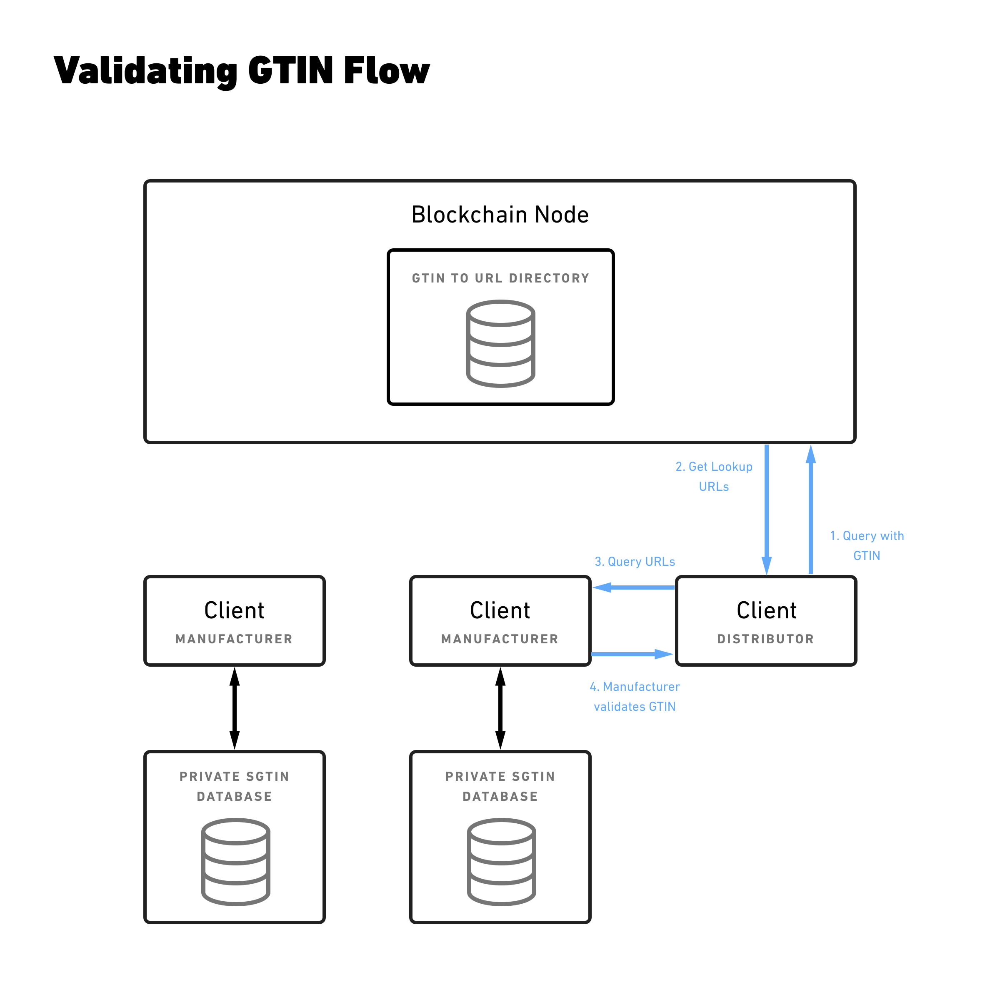

# Mediledger
#### Open source protocol for decentralized SGTIN verification and GTIN ownership transfer

* [Overview](https://github.com/chronicled/mediledger/blob/master/overview/README.md): See here for a business and technical overview of the project. As a preview, the following diagram illlustrates the various components and the flow to verify an SGTIN. The overview describes the components and the use cases.

## Documentation

* [Smart contracts](https://chronicled.github.io/mediledger/docs/CompanyDirectoryInterface/)

* [Smart contracts usage example](https://github.com/chronicled/mediledger/blob/master/examples/Smart%20Contracts.md)

## Useful Links

* GitHub repository: https://github.com/chronicled/mediledger

* Mediledger website: https://www.mediledger.com

## License
Copyright (c) 2018 Chronicled Inc All Rights Reserved
